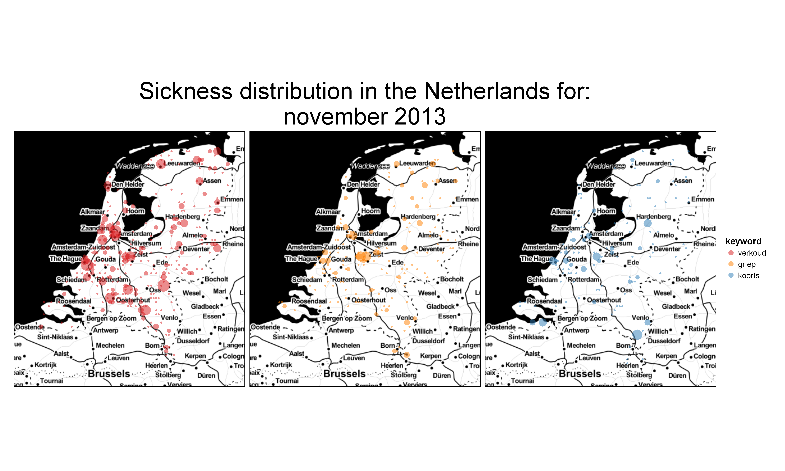
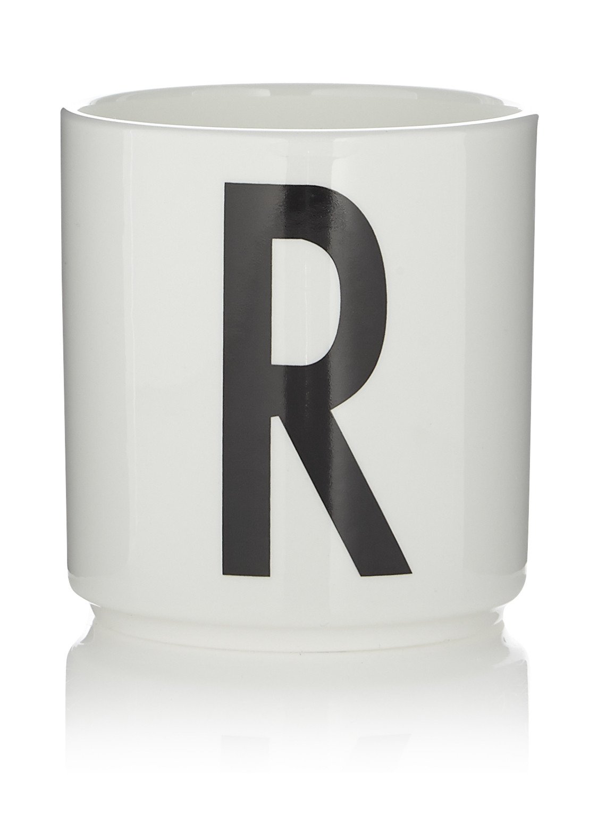

Mapping sicknesses in the Netherlands using Twitter
========================================================
author: Damiano Luzzi & Robbert-Jan Joling
date: 30-01-2015
transition: rotate

Overview
========================================================

- (Geo)Objective

- Twitter data collection

- Difficulties

- Output

- Lessons learned

(Geo)Objective
========================================================

- Show how easy it is to collect and manipulate data from Twitter

- Subject with spatial and temporal distribution

- Our search keywords: cold, flu, fever

- (Hopefully) see a nice spatial and temporal trend


Twitter data collection
========================================================

- twitteR package

- Twitter API: Rest and Streaming API

- Database in Gaia since November 11 2013

Difficulties I
========================================================

- Filtering with SQL statements

- Commas in tweet as well as .CSV

- Plotting using ggPlot

- Using loop to save files as .PNG

Difficulties II
========================================================
**Filtering to remove irrelevant tweets**


```r
matrix <- as.matrix(df)
matrix2 <- tolower(matrix)

## Iterate each row in the .CSV file in reversed order, delete the row when a keyword is found
for (row in nrow(matrix): 1){
  line <- matrix2[row, ]
  for (keyword in list){
    if (grepl(keyword, matrix2[row, 1])){
      matrix <- matrix[-row, ]
      break
    }
  }
}
```

Output
========================================================



Lessons learned
========================================================

- Regexp not always needed

- Keep it simple

- 'Easy' things aren't always so easy!

- API's make data collection and maipulation accessible for practically everyone

Questions?
========================================================


